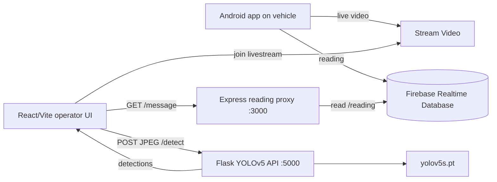

# Indri

> Remote-controlled vehicle for hazardous gas detection

Indri is a prototype remote-monitoring system for a vehicle operating in environments that may be unsafe for people. An Android app on the vehicle publishes a live camera stream and sensor readings. This web application lets a remote operator watch the stream, view object-detection overlays, monitor the latest reading, and export captured readings as a PDF.

This repository contains the web prototype and its supporting services. It is not safety-certified, production-hardened, or a substitute for validated industrial gas-detection equipment.

[](https://react.dev/)
[](https://www.typescriptlang.org/)
[](https://vitejs.dev/)
[](https://nodejs.org/)
[](https://expressjs.com/)
[](https://www.python.org/)
[](https://github.com/ultralytics/yolov5)

## Features

- Live vehicle video through Stream Video.
- YOLOv5 inference on sampled video frames.
- Bounding-box overlays rendered over the live video.
- Firebase Realtime Database reading display through an Express endpoint.
- One-second reading polling in the operator UI.
- Start/stop capture and export readings to `readings.pdf`.
- CORS-enabled local development services.

## Architecture



### Repository layout

```text
livestream-app/
├── frontend/             React + TypeScript + Vite operator interface
├── backend/              Express API and Firebase Realtime Database client
└── flask-backend/        Flask API, YOLOv5 inference, and model weights
```

## Technology stack

| Area | Technology |
| --- | --- |
| Operator UI | React, TypeScript, Vite |
| Video | Stream Video React SDK |
| Reading transport | Express, Firebase Realtime Database |
| Detection API | Flask, Flask-CORS |
| Computer vision | PyTorch, Torch Hub, YOLOv5, OpenCV, Pillow, NumPy |
| Reporting | jsPDF |

## Prerequisites

- Node.js 18 or newer and npm.
- Python 3.9 or newer.
- A Python environment with a PyTorch build appropriate for the host CPU or GPU.
- A Firebase project with Realtime Database enabled.
- A Stream account and a livestream containing the configured call ID.
- The Android vehicle app publishing to the same Stream call and Firebase path.

## Installation

Clone the repository and install each JavaScript service independently:

```bash
git clone <your-repository-url>
cd livestream-app

cd backend
npm install

cd ../frontend
npm install
```

Create and activate a Python virtual environment, then install the Flask service dependencies. The repository currently does not include a `requirements.txt`, so install the packages explicitly:

```bash
cd ../flask-backend
python -m venv .venv

# macOS/Linux
source .venv/bin/activate

# Windows PowerShell
.\.venv\Scripts\Activate.ps1

python -m pip install --upgrade pip
python -m pip install flask flask-cors torch torchvision opencv-python numpy pillow
```

The Flask service expects `flask-backend/yolov5s.pt`. The first model load may also download the YOLOv5 repository through `torch.hub`; network access is required unless the Torch Hub cache is already populated.

## Configuration

### Current prototype configuration

There are no environment variables consumed by the current code. The following values are currently hardcoded and must be configured in source before running with a different deployment:

| Value | Current location | Purpose |
| --- | --- | --- |
| Firebase web configuration | `backend/firebase.js` | Connects to the Realtime Database |
| Stream API key, token, user ID, call ID | `frontend/src/App.tsx` | Joins the vehicle livestream |
| Reading API URL | `frontend/src/ChatStream.tsx` | Reads the Express service, currently `http://localhost:3000` |
| Detection API URL | `frontend/src/CustomLivestreamPlayer.tsx` | Sends frames to Flask, currently `http://localhost:5000` |
| Firebase reading path | `backend/index.js` | Currently `/reading` |

Do not commit private Stream tokens or service credentials. Before production use, move these values to deployment-managed secrets and expose only non-sensitive public configuration to the Vite client. Rotate any credentials that have been shared outside the intended development environment.

## Running the prototype

Start the services in separate terminals from `livestream-app`.

### 1. Start the reading API

```bash
cd backend
npm start
```

The backend package does not currently define a `start` script. Run the entry point directly:

```bash
node index.js
```

The service listens on `http://localhost:3000`.

### 2. Start the detection API

```bash
cd flask-backend

# Activate .venv first, if it is not already active.
python app.py
```

The Flask development server listens on `http://localhost:5000`. Its health response is available at `GET /`:

```text
Object detection API using YOLO
```

### 3. Start the operator UI

```bash
cd frontend
npm run dev
```

Open the URL printed by Vite, usually `http://localhost:5173`. The browser must be able to reach both APIs and the Stream service. The vehicle Android app must already be publishing the configured Stream call for video to appear.

## API usage

### Read the latest sensor message

```bash
curl http://localhost:3000/message
```

Example response:

```json
{"message":"MQ2 Reading: 42"}
```

The Express service subscribes to Firebase Realtime Database path `/reading` and returns the latest value as the `message` property.

### Run object detection on an image

```bash
curl -X POST http://localhost:5000/detect \
  -F "image=@path/to/frame.jpg"
```

Example response:

```json
[
  {
    "bbox": [120, 80, 420, 360],
    "confidence": 0.91,
    "class": "person"
  }
]
```

The web UI captures the current video frame to JPEG and calls this endpoint approximately once per second. Detection coordinates are pixel coordinates in the submitted image.

## Development commands

Run these from `frontend`:

```bash
npm run dev       # Start Vite with hot reload
npm run build     # Type-check and create a production build
npm run lint      # Run ESLint
npm run preview   # Preview the production build locally
```

There are currently no automated tests in the frontend, Node backend, or Flask backend. Treat `npm run build`, `npm run lint`, API smoke tests, and a manual livestream check as the minimum verification for changes.

## Troubleshooting

- **The UI says “The host hasn't joined yet”:** verify the Android app is publishing to the same Stream call type (`livestream`) and call ID.
- **The reading shows an error:** start the Node service, verify Firebase Realtime Database access, and confirm that `/reading` contains a value.
- **Detection requests fail:** start Flask on port 5000, verify `yolov5s.pt` exists, and confirm that PyTorch and the OpenCV/Pillow dependencies import successfully.
- **CORS or connection errors:** use the exact localhost ports above, or update the hardcoded URLs before deploying across hosts.
- **Slow detection:** YOLOv5 inference is performed synchronously and may be CPU-bound. Reduce frame frequency, use a smaller model, or add a queue and GPU-backed inference service for real deployments.

## Production hardening checklist

- Move all credentials, URLs, call IDs, and Firebase settings to managed configuration.
- Replace the development Flask server with a production WSGI server and add authentication, rate limiting, request-size limits, and structured logging.
- Restrict CORS origins and secure all traffic with HTTPS.
- Add Firebase security rules, authentication, and least-privilege access.
- Validate image type and size before inference; handle malformed images and model failures with consistent error responses.
- Add monitoring for stream availability, sensor freshness, inference latency, and dropped frames.
- Validate gas sensor calibration and define alarm thresholds with domain and safety experts.
- Add automated tests for the APIs, sensor parsing, PDF export, and video/detection integration.

## Project status

Indri is an experimental prototype for remote hazardous-gas monitoring. Interfaces, credentials, model behavior, and deployment practices may change as the vehicle and Android application mature.